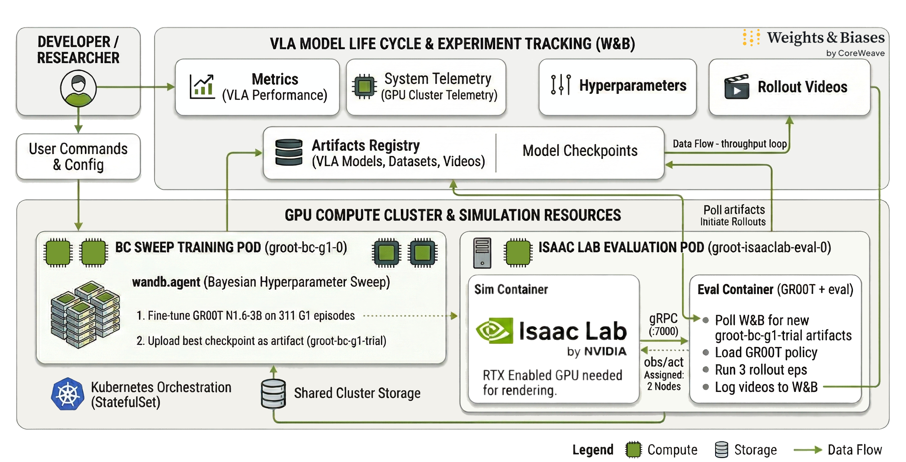

# NVIDIA Blueprint

## Vision Language Action (VLA) Finetuning and Evaluation with Isaac Lab + Weights & Biases

<p align="center">
  
  
  
</p>

## [Live Project: VLA Finetuning + Evals on W&B](https://wandb.ai/wandb-smle/isaacsim-nvidia-vla-crwv/sweeps/v2aohfof?nw=sxt5zec5kh)

Access the [GitHub Repo](https://github.com/anu-wandb/w-b-nvidia-isaac-lab-vla)

<p align="center">
  
</p>

## Overview

This blueprint demonstrates how robotics teams can fine-tune [Vision
Language Action (VLA)](https://research.nvidia.com/labs/gear/gr00t-n1_5/) models and leverage NVIDIA Isaac Lab for
high-fidelity, simulation-based rollouts to accelerate research and
development.

It delivers a production-ready architecture for:

-   Distributed training
-   Automated checkpoint evaluation
-   Scalable simulation workflows

The entire lifecycle from hyperparameter sweeps and artifact
versioning to rollout metrics and video logging is unified in[Weights & Biases (W&B)](https://wandb.ai/site/), accelerating the sim-to-real development loop and
providing a centralized, reproducible system of record for model
development at scale.

## What You'll Build

A distributed VLA fine-tuning system for [Behavioral Cloning (BC)](https://arxiv.org/abs/2407.15007) that:

-   Adapts a pretrained foundation model to a specific robot embodiment
-   [Uses large-scale teleoperation data (human-operated robot
    demonstrations)](https://www.automate.org/robotics/industry-insights/teleoperation-is-a-powerful-tool-for-humanoid-robots-but-transparency-is-key)
-   Automatically versions model artifacts
-   Evaluates every checkpoint in Isaac Lab using high-fidelity
    simulation rollouts

## Key Capabilities

-   **Distributed Training** -- Multi-node GPU fine-tuning
-   **Foundation Model Adaptation** -- GR00T-based VLA policy
    refinement
-   **Closed-Loop Simulation Evaluation** -- Continuous checkpoint
    validation
-   **Headless Cluster Execution** -- Containerized, Kubernetes-native
-   **Integrated Experiment Tracking** -- Metrics, artifacts, and media
    unified
-   **Automated Model Versioning** -- Artifact lineage and
    reproducibility
-   **Team Collaboration** -- Dashboards, Reports, and Workspace Views
    in W&B

------------------------------------------------------------------------

## Architecture

This blueprint uses a multi-pod Kubernetes architecture that runs
distributed training and simulation + evaluation environments to avoid
version conflicts and simplify scaling across development stages.

<p align="center">
  
</p>


## 1. GPU Compute Cluster

At the foundation is a scalable GPU cluster orchestrating multi-pod
training and evaluation workflows for VLA fine-tuning.

The system consists of two primary pods:

### Behavior Cloning Hyperparameter Sweep Training Pod

Runs distributed fine-tuning of the VLA foundation model using LoRA and
hyperparameter sweeps.

Minimum 48GB VRAM (e.g., RTX 6000 Ada, L40, A6000)

-   Each trial logs metrics to W&B
-   Fine-tunes the GR00T foundation model on teleoperation data
-   Executes Bayesian hyperparameter sweeps via the W&B SDK
-   Publishes best checkpoints as versioned W&B artifacts

### Isaac Lab Evaluation Pod

Continuously monitors W&B for new checkpoints and evaluates them in
closed-loop simulation.

Example configuration: 2× L40 GPUs

This pod contains two containers:

-   **Simulation Container** -- Runs Isaac Lab headlessly
-   **Evaluation Container** -- Loads policies, executes rollouts, and
    logs metrics and videos

Containers communicate locally via gRPC.

Artifacts logged in W&B serve as the bridge between pods, enabling
decoupled training and evaluation with full lineage tracking.

* We recommend using RTX-enabled NVIDIA GPUs such as RTX 6000 Pro or L40
for rendering high-fidelity simulation videos alongside training and
rollout metrics. *

All environments run in containerized runtimes (via NVIDIA NGC) and
scale horizontally across multi-node GPU workers.


## 2. VLA Training & Isaac Lab Simulation Layer

This layer performs distributed Behavioral Cloning on a pretrained VLA
foundation model and continuously evaluates fine-tuned checkpoints in
simulation.

Capabilities:

-   LoRA-based fine-tuning of GR00T foundation model
-   Distributed training via `torch.distributed`
-   Artifact-based model versioning
-   Closed-loop rollout evaluation in Isaac Lab
-   GPU-accelerated physics and RTX rendering

Continuous system loop:

```
Foundation Model → Fine-Tune → Version Artifact → Simulate → Log → Compare
```


## 3. Experiment Tracking & Model Lifecycle (W&B)

All training and evaluation outputs stream to [Weights & Biases (W&B)](https://wandb.ai/site/models/).

W&B captures:

-   Metrics
-   System telemetry
-   Hyperparameters
-   Checkpoints
-   Rollout videos
-   Full artifact lineage from foundation model to evaluated policy

Simulations are auto-synced to checkpoints and experiments, helping
teams connect metrics to rollout episodes in a single pane of glass.


## ML Workflow

Training begins with distributed Behavioral Cloning across GPUs. The pretrained VLA foundation model is adapted using teleoperation demonstrations. Each trial produces a versioned model artifact.

Evaluation pods monitor for new artifacts and automatically run simulation rollouts in Isaac Lab. Metrics and videos are logged back to W&B, enabling immediate comparison across checkpoints.

This closed-loop system: fine-tune → version → simulate → log, which enables rapid iteration without sacrificing reproducibility or observability.

## Why NVIDIA Isaac Sim + Isaac Lab

Isaac Sim delivers photorealistic, GPU-accelerated robotics simulation, while Isaac Lab provides scalable RL and policy training workflows. Together, they enable high-fidelity simulation and evaluation of foundation VLA models before deployment.

## Why Weights & Biases (Experiment Tracking Layer)

Weights & Biases provides a unified experiment control plane synchronizing metrics, artifacts, simulation rollouts, and configurations into a single reproducible system of record. Teams can compare checkpoints, trace model lineage, and automate evaluation workflows as training scales.

WandB SDK offers an out-of-the-box integration with IsaacLab, allowing your teams to capture all of this data by simply passing your `WANDB_API_KEY` and target project information for your W&B environment.

Training is monitored centrally through Weights & Biases Workspace, where metrics, system telemetry, simulation videos, and checkpoints are visualized in real time. Teams can define alerts on key signals such as reward thresholds, loss divergence, or system utilization to proactively monitor training health as workloads scale.

Beyond live monitoring, W&B Reports ([see example auto-generated report here](https://github.com/anu-wandb/robotics_automation_demo/blob/main/scripts/generate_wandb_report.py)) enable teams to create shareable, structured summaries of experiments, combining charts, rollout videos, configurations, and analysis in a single collaborative document. This makes it easy to review results, compare runs, communicate findings across teams, and maintain a durable record of research progress.

Together, dashboards, alerts, and reports provide continuous visibility from experiment execution to results dissemination.

------------------------------------------------------------------------

## References

-   [Isaac Lab GitHub](https://github.com/isaac-sim/IsaacLab)
-   [Isaac Sim Documentation](https://docs.isaacsim.omniverse.nvidia.com/5.1.0/index.html)
-   [Isaac-GR00T Documentation](https://github.com/NVIDIA/Isaac-GR00T)
-   [Weights & Biases Documentation](https://docs.wandb.ai/)
-   [Kubernetes Documentation](https://kubernetes.io/docs/)
-   [NVIDIA NGC](https://ngc.nvidia.com/)
