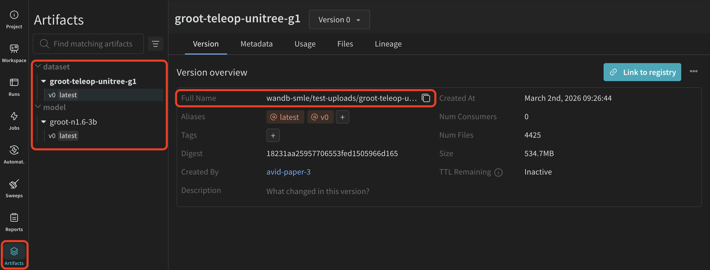

<p align="center">
  
  
  
</p>

# Fine-Tuning GR00T N1.6 VLA with Isaac Lab Simulation + Weights & Biases 

This guide explains how to run an end-to-end **Behavioral Cloning (BC) sweep + Isaac Lab closed-loop evaluation** pipeline for NVIDIA's GR00T N1.6-3B Vision-Language-Action model on a Kubernetes GPU cluster with Weights & Biases tracking.

This setup supports:

- Bayesian hyperparameter sweep for Behavioral Cloning fine-tuning (8× L40 GPUs on one pod)
- Automated closed-loop evaluation in Isaac Lab simulation (2× L40 GPUs on a separate pod)
- Two-container pod architecture (sim + eval) with gRPC communication
- Automatic W&B logging: training curves, rollout videos, model artifacts
- Continuous evaluation: new checkpoints are picked up and evaluated automatically

## See this pipeline running live on W&B: [GR00T VLA + Isaac Lab on CoreWeave](https://wandb.ai/wandb-smle/isaacsim-nvidia-vla-crwv/sweeps/v2aohfof?nw=sxt5zec5kh)

<p align="center">
  
</p>

# Architecture Overview

The pipeline has two stages that run on separate pods. Running both concurrently requires **10× L40 GPUs** (8 for training + 2 for eval). If your cluster has fewer GPUs, you can run the stages sequentially — complete the BC sweep first, then tear it down and launch eval.

```
┌─────────────────────────────────────────────────────────────────────┐
│                     BC Sweep Training Pod                           │
│                     groot-bc-g1-0 (8× L40)                          │
│                                                                     │
│  wandb.agent (Bayesian sweep)                                       │
│    ├── Trial 1: lr=1.09e-4, grad_accum=64, steps=20000              │
│    ├── Trial 2: lr=2.3e-4,  grad_accum=32, steps=15000              │
│    └── ...                                                          │
│                                                                     │
│  Each trial:                                                        │
│    1. Fine-tune GR00T N1.6-3B on 311 G1 teleop episodes             │
│    2. Upload best checkpoint as W&B artifact (groot-bc-g1-trial)    │
└────────────────────────┬────────────────────────────────────────────┘
                         │ W&B Artifacts
                         ▼
┌─────────────────────────────────────────────────────────────────────┐
│               Isaac Lab Evaluation Pod                              │
│               groot-isaaclab-eval-0 (2× L40)                        │
│                                                                     │
│  ┌────────────────────┐    gRPC    ┌────────────────────────┐       │
│  │  Sim Container     │◄──────────►│  Eval Container        │       │
│  │  (Isaac Lab 2.3.2) │  :7000     │  (GR00T + eval)        │       │
│  │                    │            │                        │       │
│  │  G1 robot          │  obs/act   │  Poll W&B for new      │       │
│  │  + table + cube    │◄──────────►│  groot-bc-g1-trial     │       │
│  │  + camera          │            │  artifacts             │       │
│  │                    │            │                        │       │
│  │  JointPosition     │            │  Load GR00T policy     │       │
│  │  ActionCfg         │            │  Run 3 rollout eps     │       │
│  │                    │            │  Log videos to W&B     │       │
│  └────────────────────┘            └────────────────────────┘       │
└─────────────────────────────────────────────────────────────────────┘
```

### Key Design Decisions

- **Two-container pods**: Isaac Lab requires Python 3.11 (bundled in `nvcr.io/nvidia/isaac-lab:2.3.2`), while GR00T requires Python 3.10. The containers share a pod and communicate over localhost gRPC.
- **Fixed-base robot**: The G1 robot's root link is fixed (`fix_root_link = True`) for tabletop manipulation evaluation.
- **Joint position control**: GR00T outputs per-body-part joint positions/deltas, which are mapped to Isaac Lab's flat 37-DOF action space via `G1JointMapper`.
- **RELATIVE vs ABSOLUTE actions**: Arms and legs use relative (delta) actions, while waist and hands use absolute targets. The mapper converts relative deltas to absolute positions by adding them to the current joint state.

For deeper technical details (GR00T model internals, joint DOF mapping tables, evaluation loop implementation), see [ARCHITECTURE.md](ARCHITECTURE.md).

---

# Prerequisites

## Kubernetes Cluster

A Kubernetes GPU cluster with NVIDIA L40 (or equivalent) GPUs. This guide uses [CoreWeave](https://www.coreweave.com/).

- **Concurrent mode**: 10× L40 GPUs (8 for BC training pod + 2 for eval pod)
- **Sequential mode**: 8× L40 GPUs (run training first, then eval)

```bash
kubectl config get-contexts
kubectl config use-context <your-cluster-context>
```

## NVIDIA NGC Access

Create an [NGC account](https://ngc.nvidia.com) and generate an API key. The pipeline uses container image `nvcr.io/nvidia/isaac-lab:2.3.2`.

```bash
kubectl create secret docker-registry nvcr-secret \
  --docker-server=nvcr.io \
  --docker-username='$oauthtoken' \
  --docker-password='<YOUR_NGC_API_KEY>'
```

## Weights & Biases Setup

Create a [W&B account](https://wandb.ai) and generate an [API key](https://wandb.ai/authorize).

```bash
kubectl create secret generic wandb-api-key \
  --from-literal=WANDB_API_KEY=<YOUR_WANDB_API_KEY>
```

## Base Model & Teleop Dataset

The pipeline requires two W&B artifacts:

| Artifact | Source | W&B Name |
|----------|--------|----------|
| GR00T N1.6-3B base model | [nvidia/GR00T-N1.6-3B](https://huggingface.co/nvidia/GR00T-N1.6-3B) | `groot-n1.6-3b` |
| G1 teleop dataset (311 episodes) | [nvidia/PhysicalAI-Robotics-GR00T-Teleop-G1](https://huggingface.co/datasets/nvidia/PhysicalAI-Robotics-GR00T-Teleop-G1) | `groot-teleop-unitree-g1` |

The included [`upload_inputs.py`](upload_inputs.py) script downloads both from HuggingFace and uploads them to your W&B project:

```bash
pip install wandb huggingface_hub
python upload_inputs.py --entity <YOUR_WANDB_ENTITY> --project <YOUR_WANDB_PROJECT>
```

This will download ~15 GB of model weights and ~2 GB of teleop data, then upload them as versioned W&B artifacts. You can skip either with `--skip-model` or `--skip-dataset` if already uploaded.

You can follow the links provided by WandB SDK or go to your workspace and navigate to `Artifacts` -> `Models/Datasets`-> `Versions`

<p align="center">
  
</p>

Grab the `Full Name` for these artifacts. We will need to map these in our script later to use them as inputs to our training.  

---

# Running the Pipeline

**Before applying**, update both YAML files with your W&B entity, project, and artifact names. The values to change:

In `groot-bc-unitree-g1.yaml` (lines 843–857):
```yaml
- name: WANDB_ENTITY
  value: <YOUR_WANDB_ENTITY>        # line 844
- name: WANDB_PROJECT
  value: <YOUR_WANDB_PROJECT>       # line 846
- name: BASE_VLA_ARTIFACT
  value: <ENTITY/PROJECT/groot-n1.6-3b:v1>          # line 855
- name: DATASET_ARTIFACT
  value: <ENTITY/PROJECT/groot-teleop-unitree-g1:v0> # line 857
```

In `groot-isaaclab-eval.yaml` (lines 1655–1658):
```yaml
- name: WANDB_ENTITY
  value: <YOUR_WANDB_ENTITY>        # line 1656
- name: WANDB_PROJECT
  value: <YOUR_WANDB_PROJECT>       # line 1658
```

Use the artifact `Full Name` from your W&B project (see [Base Model & Teleop Dataset](#base-model--teleop-dataset)).

## Stage 1: Setup Hyperparameter Sweep for VLA Finetuning

Launches a Bayesian hyperparameter sweep that fine-tunes GR00T on G1 teleop data.

```bash
kubectl apply -f groot-bc-unitree-g1.yaml
```

This creates a single pod (`groot-bc-g1-0`) with 8× L40 GPUs running DDP training. The sweep explores:

| Parameter | Range |
|-----------|-------|
| Learning rate | 5e-5 — 3e-4 |
| Gradient accumulation | 16, 32, 64 |
| Max training steps | 10,000 — 30,000 |

Each trial:
1. Fine-tunes GR00T N1.6-3B with LoRA (PEFT) for memory efficiency during training
2. Saves fully merged weight checkpoints (not adapter-only) — this ensures the eval pod can load each checkpoint directly later
3. Logs training loss to W&B
4. Uploads the best checkpoint as artifact `groot-bc-g1-trial`

Expected end-to-end runtime: ~1 day on 10× L40 GPUs (sweep only).

## Stage 2: Isaac Lab Closed-Loop Evaluation

Automatically evaluates every checkpoint in simulation.

```bash
kubectl apply -f groot-isaaclab-eval.yaml
```

This creates a two-container pod (`groot-isaaclab-eval-0`) with 2× L40 GPUs:

- **Sim container** (GPU 0): Runs Isaac Lab with the `Isaac-G1-ManipJointCtrl-v0` environment — a Unitree G1 robot at a table with a red cube
- **Eval container** (GPU 1): Polls W&B for new `groot-bc-g1-trial` artifacts, downloads each checkpoint, runs 3 rollout episodes (3000 steps each), and logs videos + metrics back to W&B

The eval loop runs continuously — it polls the W&B API every 60 seconds for new artifact versions. As the training produces new checkpoints, they are automatically picked up and evaluated.

---

# View Logs

## Pod Status

```bash
kubectl get pods
```

Expected output:
```
NAME                    READY   STATUS    AGE
groot-bc-g1-0           1/1     Running   10d
groot-isaaclab-eval-0   2/2     Running   4d
```

## Logs

```bash
# BC sweep training
kubectl logs groot-bc-g1-0 --tail=20

# Eval — sim container
kubectl logs groot-isaaclab-eval-0 -c sim --tail=20

# Eval — eval container
kubectl logs groot-isaaclab-eval-0 -c eval --tail=20
```

# Monitoring Training 

## W&B Dashboard

- **Project**: [`wandb-smle/isaacsim-nvidia-vla-crwv`](https://wandb.ai/wandb-smle/isaacsim-nvidia-vla-crwv)
- **Sweep runs**: Training loss curves for each trial
- **Eval metrics** (logged to each trial's original run):
  - `eval/mean_reward` — mean episode reward
  - `eval/mean_episode_length` — mean episode length
  - `eval/termination_rate` — fraction of episodes terminated early
  - `eval/checkpoint` — which checkpoint was evaluated
  - Rollout videos attached as `wandb.Video` media

---

# Configuration

## Hyperparameter Sweep (`groot-bc-unitree-g1.yaml`)

| Variable | Default | Description |
|----------|---------|-------------|
| `WANDB_ENTITY` | `wandb-smle` | W&B entity |
| `WANDB_PROJECT` | `isaacsim-nvidia-vla-crwv` | W&B project |
| `BASE_VLA_ARTIFACT` | `groot-n1.6-3b:v1` | Base GR00T model |
| `DATASET_ARTIFACT` | `groot-teleop-unitree-g1:v0` | Teleop training data |
| GPU allocation | 8× L40 | DDP training |

## Eval (`groot-isaaclab-eval.yaml`)

| Variable | Default | Description |
|----------|---------|-------------|
| `ISAAC_TASK` | `Isaac-G1-ManipJointCtrl-v0` | Isaac Lab environment |
| `TASK_DESCRIPTION` | `Pick up the apple and place it on the plate` | Language prompt (matches teleop training data; sim uses a cube as stand-in object) |
| `N_EPISODES` | `3` | Rollout episodes per checkpoint |
| `MAX_STEPS` | `3000` | Max steps per episode |
| Sim GPU | 1× L40 | Isaac Lab simulation |
| Eval GPU | 1× L40 | GR00T inference |

---

# Cleanup

```bash
# Stop the BC sweep
kubectl delete -f groot-bc-unitree-g1.yaml

# Stop the eval pipeline
kubectl delete -f groot-isaaclab-eval.yaml

# Or scale down without deleting (preserves config)
kubectl scale statefulset groot-bc-g1 --replicas=0
kubectl scale statefulset groot-isaaclab-eval --replicas=0
```

# Troubleshooting

### Pod not starting

```bash
kubectl describe pod groot-bc-g1-0
```

Common issues:
- GPU resources not available → check node GPU allocation
- Image pull errors → verify NGC secret exists
- W&B secret missing → create `wandb-api-key` secret

### Eval not picking up new checkpoints

The eval container tracks evaluated artifacts in memory (cleared on pod restart). If checkpoints are being skipped:

```bash
# Restart to re-evaluate all checkpoints
kubectl delete pod groot-isaaclab-eval-0
```

Re-evaluating checkpoints is safe — metrics are logged with the checkpoint name and will not overwrite previous results.

### flash_attn errors

L40 GPUs don't support `flash_attn_2`. The entrypoint scripts automatically patch Eagle backbone to use `sdpa` and create a `flash_attn` stub package.

---

# Workflow Summary

1. Apply sweep YAML → starts hyperparameter search
2. Apply eval YAML → starts polling for checkpoints
3. As each sweep trial completes, it uploads a checkpoint artifact to W&B
4. The eval pod downloads the checkpoint, runs 3 rollout episodes in Isaac Lab, and logs videos + metrics back to W&B
5. Monitor everything in the W&B dashboard

---

# References

- GR00T N1.6: https://github.com/NVIDIA/Isaac-GR00T
- Isaac Lab: https://isaac-sim.github.io/IsaacLab/
- Isaac Sim: https://docs.isaacsim.omniverse.nvidia.com/
- Weights & Biases Docs: https://docs.wandb.ai/
- CoreWeave Docs: https://docs.coreweave.com/
